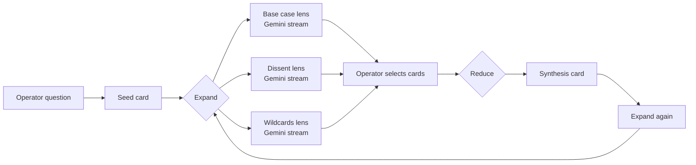
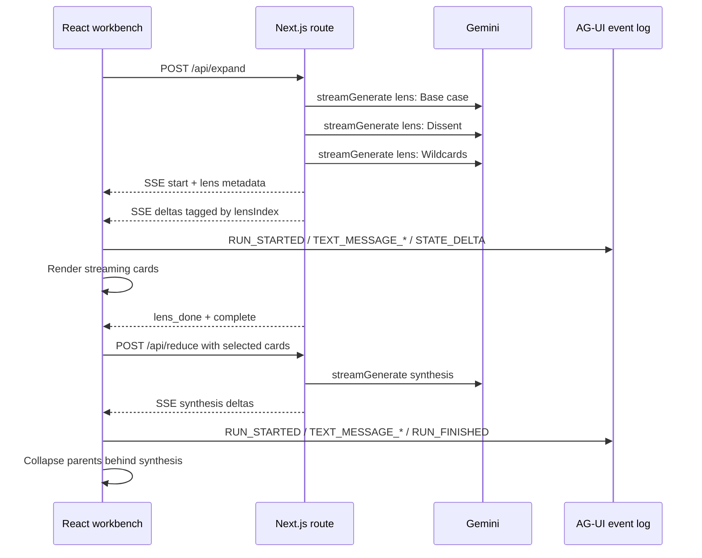

# Macro Mixer

**A generative-UI workbench for map / reduce research.**

Macro Mixer turns one question into a living board of model-generated research cards. The operator expands an idea through multiple lenses, selects the strongest cards, then reduces them into a synthesis without losing provenance.

This is not a chatbot. The primary interface is the generated work surface: cards bloom, collapse, stream, preserve parent links, and expose the model trace that produced them.

```text
question -> Expand through lenses -> select cards -> Reduce into synthesis -> repeat
```

## Hackathon Stack

Built for the **Generative UI Global Hackathon: Agentic Interfaces** in Hong Kong.

| Layer | Technology | How Macro Mixer uses it |
|---|---|---|
| Model provider | **Google Gemini** via `@google/genai` | Server-side streaming inference for expand and reduce operations |
| Agent/UI event protocol | **AG-UI** via `@ag-ui/core` | Run lifecycle, text stream, custom, snapshot, and state-delta events |
| App framework | **Next.js App Router** | Single-screen workbench plus streaming API routes |
| UI runtime | **React 19** | Interactive board, selection, reader, persistence, and live stream rendering |
| Styling | **Tailwind CSS 4** | Fast projector-friendly layout and responsive card surface |
| Generative UI target | **A2UI-ready architecture** | Board state is projection-friendly: cards, events, provider lanes, provenance |
| Extension track | **CopilotKit / MCP Apps ready** | Current MVP is direct and lean; those integrations can sit on the same event/state model |

## What It Demonstrates

- **Generated work surface, not chat**: model output becomes structured, selectable cards.
- **Parallel map step**: one parent card fans out into multiple Gemini streams, each with a different lens.
- **Human-directed reduce step**: the operator selects cards and synthesizes them into a new card.
- **Provenance-first UX**: every generated card records parents, directive, lens, provider, model, and status.
- **Streaming interface**: cards update as Gemini streams, with per-lens lifecycle events.
- **Recoverable sessions**: board state persists through the `?s=<uuid>` URL and `localStorage`.

## Visual Flow



## Runtime Architecture



## Demo Script

1. Enter a question worth analyzing.
2. Press `Enter` to expand it into three live Gemini lens cards.
3. Watch the board stream in parallel: **Base case**, **Dissent**, and **Wildcards**.
4. Select two or more completed cards.
5. Click `Reduce N cards`.
6. Open the synthesis card and point out that the parent cards are collapsed, not deleted.
7. Branch again from the synthesis to show recursive map / reduce.

Strong demo seeds:

```text
How should small AI teams evaluate agent UX in 2026?
```

```text
What would make generative UI meaningfully better than chat for research work?
```

```text
Where will AI workbenches fail when they move from demos to production?
```

## Key Concepts

### Expand

`POST /api/expand` opens parallel Gemini streams, one per lens:

- **Base case**: the most plausible reading.
- **Dissent**: contradictions, missing evidence, and second-order effects.
- **Wildcards**: low-probability, high-impact paths.

Each lens produces a child card whose `parentIds = [parentCardId]`.

### Reduce

`POST /api/reduce` sends selected completed cards into one synthesis stream.

The new synthesis card records all selected source ids in `parentIds`. The source cards keep their data and are visually tucked behind the synthesis via `collapsedIntoId`.

### Provenance

Every generated card records:

- `parentIds`
- `directive`
- `lensId` / `lensName` for expand cards
- `provider`
- `model`
- `status`
- `opId`
- `createdAt`

That makes the board inspectable as an inference graph instead of a pile of text.

## Project Map

```text
src/app/
  page.tsx                  Workbench entry point
  api/expand/route.ts       Parallel lens streams over SSE
  api/reduce/route.ts       Synthesis stream over SSE

src/components/
  MacroMixerPrototype.tsx   Controller: state, selection, persistence, SSE
  SeedComposer.tsx          First-run question input
  FullscreenReader.tsx      Focused markdown reader
  ReduceFab.tsx             Floating reduce action

src/components/mixboard/
  BoardCanvas.tsx           Card grid, marquee selection, expand affordance
  provider-lanes.ts         Provider outlet lane ids
  ui.ts                     Shared UI helpers

src/lib/gemini/
  client.ts                 Narrow Gemini wrapper
  lenses.ts                 Lens and reduce prompts
  rollup.ts                 Streaming roll-up parser
  sse.ts                    Shared SSE frame types and parser

src/lib/mixboard/
  kernel.ts                 Card domain type
  agui-events.ts            AG-UI event constructors
```

## Setup

```bash
npm install
echo "GEMINI_API_KEY=your_key_here" > .env.local
npm run dev
```

Open `http://localhost:3000`.

Optional model override:

```bash
echo "GEMINI_MODEL=gemini-2.5-flash" >> .env.local
```

The default model alias is `gemini-flash-latest`.

## Verification

```bash
npm run typecheck
npm run build
```

Manual browser pass:

1. Start with a fresh URL by removing `?s=...`.
2. Expand one seed question.
3. Wait for all three lens cards to complete.
4. Select at least two cards and reduce them.
5. Reload the page and confirm the board restores.
6. Open a card and confirm the markdown reader renders the long-form body.

## API Frames

### `/api/expand`

```ts
{ type: "start"; opId; parentCardId; directive; lenses; model }
{ type: "lens_start"; lensIndex }
{ type: "delta"; lensIndex; text }
{ type: "lens_done"; lensIndex; text }
{ type: "lens_error"; lensIndex; message; kind; detail? }
{ type: "complete" }
{ type: "error"; message; kind; detail? }
```

### `/api/reduce`

```ts
{ type: "start"; opId; cardId; sourceCardIds; directive; model }
{ type: "delta"; text }
{ type: "done"; text }
{ type: "error"; message; kind; detail? }
```

## Submission Notes

Suggested one-sentence pitch:

> Macro Mixer is a generative-UI research board where Gemini expands an idea through parallel lenses, then reduces selected cards into a provenance-preserving synthesis.

Protocols and providers to list:

- **Google Gemini**: live streaming inference provider.
- **AG-UI**: event model used for run lifecycle, text streams, state deltas, and custom events.
- **A2UI**: architecture-compatible projection target; the current MVP uses native React cards as the trusted catalog surface.
- **CopilotKit**: not required in the current lean prototype; compatible future bridge for a copilot/sidebar workflow.
- **MCP Apps**: not required in the current lean prototype; compatible future path for richer sandboxed tools.

## Design Principle

The durable object is not a chat transcript. It is a graph of generated work:

```text
Card = content + parents + directive + lens + provider + model + status
```

The UI is a projection of that graph.
